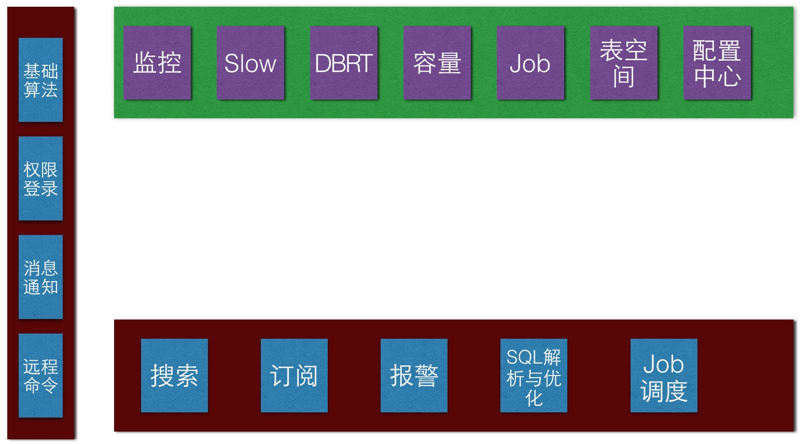
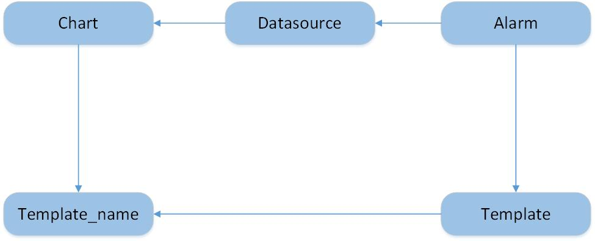
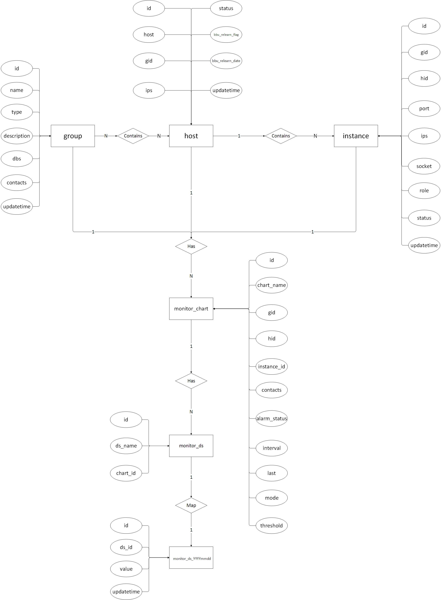
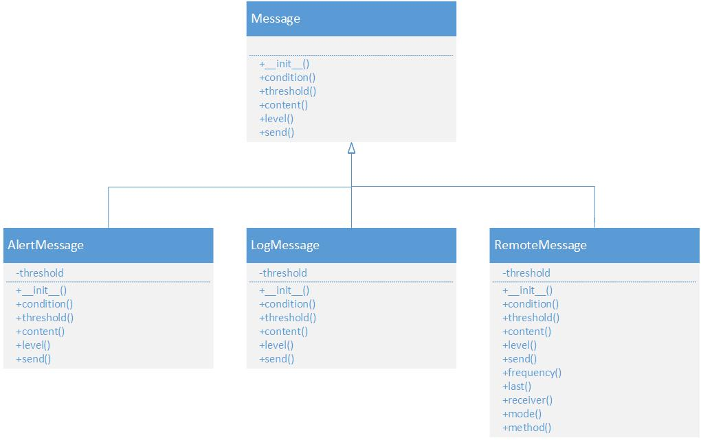
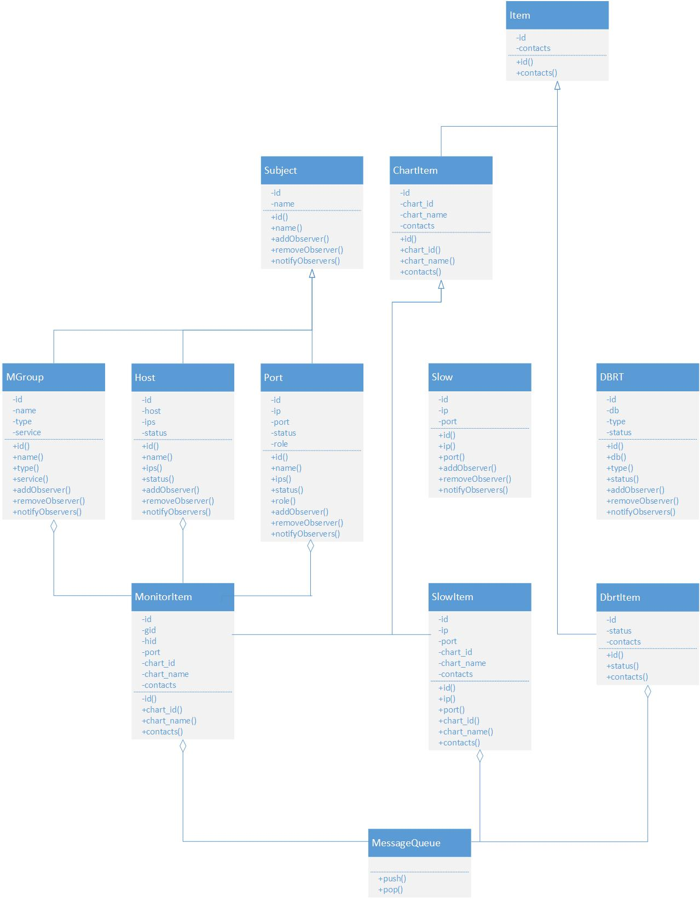

Omega Preliminary Design
===

引言
---

### 目的

统一DBA目前系统，为DBAs提供一个方便的平台，减少DBAs一些重复繁琐的工作。

### 背景

目前老系统对Mysql监控图表的显示异常，对Nosql监控缺乏，对slow，dbrt等系统有需求，急需一套管理系统，所以本系统提上日程。目前系统名叫Omega，对于以后分布在各监控对象上的Agent，可命名为 Alpha。

总体设计
---

第一期完成最基本的监控和报警功能，第二期完成slow，dbrt等功能，后续还会增加job调度管理等功能。期间会不定时的对系统进行完善和优化。

### 需求分析

#### 监控

对于监控模块，需要满足如下条件：

- 提供 RESTful API
- 3种级别的展示，每种级别的展示包括相应级别需要监控的具体项，每个具体项为一张图表，每个具体项中可包括一级子项——即每张图中可包括多种子监控项。3种级别如下：
 - 组/集群
 - Host
 - Instance
- 每种级别都可以被订阅及接警
- 能满足自定义监控

#### 报警

报警模块需要尽量提供可定制化。其内容主要如下：

- 接警人   
- 报警频率  
  每隔多长时间接收报警
- 延迟报警  
  连续N分钟异常则报警
- 报警方式  
 可使用消息通知中的方法
- 报警阈值
 - 差值
     - 具体值
     - 百分比
 - 极值
 - 斜率

#### CMC

整个系统的配置中心，包括如下范围：

- SSH KEY

#### 日志
分为两种日志，系统本身运行的日志和用户操作日志。

### 运行环境

全系统使用的软件及版本如下：

- Python2.7
- Flask-0.10.1 
- Flask-SQLAlchemy-2.0
- WTForms-2.0.2(flask-wtf-0.12)
- requests-2.7.0
- flask-login-0.2.11


### 基本设计概念和处理流程
总体结构图如下：



各个子平台如下：
- Monitor
- Slow
- DBRT
- Report
- Job

先说下通用模块。

- 登录与权限
- 远程执行命令
- 消息通知（邮件、短信）
- 基础算法
- 订阅
- 报警

对于不同的模块，可使用不同的消息通知方法，如监控报警的消息通知可为邮件和短信，而 DBRT，Slow等模块只需使用邮件提醒即可。对于用户的操作部分，直接在页面提示。

- 搜索
- SQL解析与优化
- Job调度

### 具体设计
#### 监控与报警

##### 目的

这里先说一下需求：

1. 每个图表（基本监控项）可由一个或多个数据源构成，每个图表可以有一个或多个报警条件，报警条件与图表中的监控项关联。
2. 因机器和同组类型实例，监控项和报警项基本相同，因此需要提供批量报警功能。
3. 批量开/关某模板下所有机器报警；   
4. 批量增删改，开/关某模板下某一数据源报警；   
5. 单一开/关该机器所有报警；
6. 单一增删改，开/关该机器下某一数据源报警。

##### 分析
对于批量实现，需要建立模板表，并可以用于初始化图表，数据源表和报警表的定义。而模板可有多个，所以先设计模板t_monitor_template_name表，
其只是存储模板名，即只有两个字段：主键id和模板名。

设计模板表t_monitor_template，其包括模板id(t_monitor_name)、图表名、图表描述、该图表中的各数据源名和数据源描述、各数据源对应的监控。由于每个数据源
可以有一个或多个监控，所以其以json字符串放在mysql中。模板表用于初始化图表和监控，每次添加完主机后，选择关联该模板，这样数据源和监控都会添加。

设计报警表，除基本报警字段外，其字段还应包括template_id(t_monitor_template的id)和ds_id(ds的id)，这样
，发送报警时，只需要根据ds_id查询该表和数据源具体表即可。为方便比较，该表应有报警开启/关闭状态，发送报警时，只比较报警状态
开启的报警。

而对于需求5，6，在chart级别遍历关掉即可。

由上分析知，需要如下表满足条件：数据源定义表`t_monitor_ds`，报警规则表`t_monitor_alarm`，图表`t_monitor_chart`，监控名表`t_monitor_template_name`，
监控模板表`t_monitor_template`和数据源数据表`t_monitor_ds_YYYYmmdd`。其中`t_monitor_ds`通过图表id与图表关联。

因此，展示图表时，需要查询`t_monitor_chart`, `t_monitor_ds`和`t_monitor_ds_YYYYmmdd`；展示配置时，需要查询`t_monitor_chart`，
`t_monitor_ds`和`t_monitor_alarm`；而当需要报警时，比较`t_monitor_alarm`和`t_monitor_ds_YYYYmmdd`即可。



##### 实现
模板表有2个功能：一是初始化图表，数据源表，报警表；二是修改这些表的信息。

由于同一模板中chart name不同，同一模板同一chart中ds name不同，所以当通过模板增删改Chart信息时，可根据template_name_id和chart_name来唯一
标识chart；通过Template表中的template_name_id, chart_name, ds_name来唯一标识ds，对于Alarm关联template的id，修改起来会方便很多。

###### 初始化
1. 根据模板名，获取模板信息
2. 初始化Chart表
3. 查询指定监控项（如gid，hid等）的Chart表，对比模板信息（chart_name和template_name_id），初始化Datasource表
4. 查询指定chart的Datasource表，对比模板信息（chart_name和ds_name），初始化报警表

###### 新建模板的chart信息
1. Template表添加chart
2. Chart表中根据目标监控项，Template_name_id和chart名添加chart
3. 查询添加的chart id，name
4. 对比chart name和模板chart_name，添加Ds信息
4. 添加Alarm表

###### 修改模板的chart信息
1. 修改模板中chart信息
2. 通过template_name_id和原始chart_name修改Chart表信息

###### 删除模板的chart信息
1. Alarm删除
2. ds删除
3. Chart删除
4. 模板删除

###### 新建模板的ds信息
1. 在Template表添加项
2. 查询Chart表中template_name_id为该模板名id，chart_name为目标chart_name的Chart表id
3. 插入ds表
4. 监控表

###### 修改模板的Ds信息


###### 删除模板的ds信息
1. Alarm删除
2. ds删除
3. Chart删除
4. 模板删除

###### 添加模板的报警规则

###### 修改模板的报警规则

###### 删除模板的报警无则

###### 关掉同一模板下所有机器报警

###### 关掉同一模板下某Chart报警

在Alarm表中查询模板名(template_id)，Ds为Chart子项的为目标模板的项，将报警状态（status）置为0（关闭状态）即可

###### 关掉同一模板下某Ds报警
在Alarm表中查询模板名(template_id)为目标模板的项，将报警状态（status）置为0（关闭状态）即可

###### 目标监控项重新关联模板
1. 查询Chart表中目标监控项的各项id（目标chart_id集合）
2. 通过“目标chart_id集合”，查询Ds表中各项id（目标ds_id集合）
3. 删除Alarm表中ds_id在“目标ds_id集合”中所有项
4. 删除Ds中id为“目标ds_id集合”的项
5. 删除Chart中id为“目标chart_id集合”的项
6. 初始化Chart表，Ds表，监控表（见初始化步骤）

```
                                              t_monitor_ds_YYYYmmdd
                                                        |
                                                        | ds_id
                               chart_id                 v           ds_id
       t_monitor_chart <-------------------------- t_monitor_ds <------------ t_monitor_alarm 
            |                                           |
            | t_template_name_id                        | 
            |                                           |  
            v                                           v 
 t_monitor_template_name <----------------------- t_monitor_template          
                             t_template_name_id
```

##### 自定义监控说明

目前监控要展示的图表除了mysql，nosql一些信息外，还需要展示自定义的监控信息，**在监控图，最好能展示具体细节信息**。
自定义的监控数据可以重新建数据源表和监控表，表名以`_ext`结尾。本系统提供接口做监控报警展示用，各应用方推送数据即可。下面分别说明。

- 对业务的监控展示

业务监控具体可抽象为`部门-->业务-->业务监控项`，其中`部门`项可添加到`group`表中，业务一项可添加到`host`表，也可再新建一张表，
这里为统一起见，选择新建表。 

- app机器监控展示

对于现有cmdb，pool对应group，主机信息对应`host`表，其他类推。

- 交换机监控展示

根据机房和机架来分组，各交换机放入host表，在host级别做监控即可。

- 多层次监控展示  
若业务监控信息不能抽象为`部门-->业务-->业务监控项`，则按如下思路来实现：创建子项，若子项直接是图表，则创建图表，否则仍可创建子项，
直至最后为图表为止。如下：


#### 模板
对于很多项目而言，如监控同一类型服务，同一组Mysql业务的slowlog等，一项一项增删改很不方便，本系统将使用模板的形式，对同一类型的实例
批量统一管理，在每次新建组/主机/实例后，需选择或修改或新建相关模板，关联模板后才能完成新建流程。

##### 模板定义
不同于机器以组分类来定义实例集合，模板定义的是这些实体集合的配置，如报警阈值、启动参数等。后续相关的报警，初始化机器等均采用模板方式完成。
同一模板对实例集合并发的执行操作。

##### 模板属性说明

- 默认模板包括一些初始化项
- 模板可拷贝，拷贝的新模板可增删项目
- 除默认模板外，模板可新建
- 多个模板可一起定义某个实例集合

#### ManagementCenter
ManagementCenter是配置管理中心。

- 查看机器角色
对于Mysql/redis，有Master/Slave之分，且该角色定义在端口上。但对于Hadoop而言，其角色名为NameNode/SecondNameNode/DataNode，
一个主机也可同时做NameNode和DataNode，角色定位在主机上。Hbase角色为HMaster/RegionServer，角色定位在主机上。

#### 搜索
搜索常有的几种需求如下：
- 查找db所在的组
- 根据DBRT号查找DBRT
- 查找JOB
- 查看机器的监控
- 查看机器的slow

这里不考虑全文索引。目前所使用的方式是在相应表中再加一个字段，如对于查找db所在组的需求，其实现方法是在group表中加一个`db`字段，用以存放每个group
对应的db，查询时使用 `WHERE db LIKE %key%` 的方式来实现。此方案对字段限制过于严格，只能满足对这一字段的搜索，对于其他字段的搜索还需另写SQL语
句，不太适合全局搜索。

另外一种方案仍是每个表中再新加一个字段`search_field`，该字段存放的值是每行所有字段（不包括`search`字段本身）的合集，各字段之间以某一
个delimiter分隔。查询时使用`WHERE search_field LIKE %key%`来实现。该方法能消除前一方法的限制，但仍有一些缺点。

- 数据冗余
- `LIKE %key%` 不能使用索引，且匹配多余数据，如 `LIKE %property_db%`，除了匹配 `propertys_db`，还会匹配`propertys_db_04`
- 不能满足同时有多个匹配的情况，即使满足多个匹配的情况，但匹配词序固定，对于`condition1 condition2`，只能是`LIKE %condition1%condition2%`，
对于`condition2 condition1`的情况无法匹配出来。
- 无法自适应控制结果的重要顺序。对于所有结果返回的顺序一样，无法自适应调整优先级。

还有一种做法是建立一个搜索表，每次增删改时，同时更新搜索表。其方法为将需要搜索的字段都放在该表中，能满足多字段的搜索，同时能做到根据结果重要性排序
返回。在使用该方法时，不希望使用 `LIKE`的方式，使用在搜索输入框中会用redis/jquery来做自动完成的功能。该方法的缺点是对于少部分情况会出现搜索不
到的情况，不过对于这种情况，可以将待搜索字段加入到搜索表中即可。

当然，还可以开源的一些工具，如 solr, nutch, elasticsearch 等，这些工具对查询级别为千万以上表现良好，但增加了维护成本。

本系统做为内部系统，查询量相较而言不大太，因此这里使用搜索表的方式。

### 数据设计
#### ER图
如下



#### 数据表定义如下

包括目前Mysql的各种分组，Redis集群中分组，Memcached分组，Hadoop群集的分组等

- 组类型表    

组类型比较复杂，除了Mysql，Redis等分组外，对于自定义分组也是兼容的，如添加某部门的业务监控，在类型表中新增“业务”项，然后在`group`加部门即可。
该表数据最好同时在redis做存储以提高查询速度。
```shell
CREATE TABLE t_group_type {
    id INT UNSIGNED NOT NULL AUTO_INCREMENT,
    type VARCHAR(30) NOT NULL DEFAULT '' COMMENT '类型名',
    primary key(id)
}ENGINE=INNODB DEFAULT CHARSET=utf8;
```

- 数据库表    
存取信息是各db所对应的gid。
```shell
CREATE TABLE t_group_db {
    id INT UNSIGNED NOT NULL AUTO_INCREMENT,
    gid INT UNSIGNED NOT NULL DEFAULT 0 COMMENT '组id',
    db VARCHAR(30) NOT NULL DEFAULT '' COMMENT 'db名',
    primary key(id),
    key idx_gid(gid),
    key idx_db(db)
}ENGINE=INNODB DEFAULT CHARSET=utf8;
```
该表用来根据数据库名查询其所在的机器和查询机器的所有db。其查询语句为`select gid from t_group_db where db='$DB_NAME'`。

- Group   

存储各组，包括自定义的分组。其字段如下：

```
CREATE TABLE t_group (
id INT UNSIGNED NOT NULL PRIMARY KEY AUTO_INCREMENT,
name VARCHAR(50) NOT NULL DEFAULT '' COMMENT '组名',
type TINYINT NOT NULL DEFAULT 0 COMMENT '表all_types的id',
description VARCHAR(100) NOT NULL DEFAULT '' COMMENT '描述业务', 
scenario VARCHART(500) NOT NULL DEFAULT '' COMMENT '使用场景',
contacts VARCHAR(100) NOT NULL DEFAULT '' COMMENT '联系人id，多个联系人，以空格做分隔', 
updatetime TIMESTAMP NOT NULL DEFAULT CURRENT_TIMESTAMP ON UPDATE CURRENT_TIMESTAMP,
index idx_type(type)
) ENGINE=INNODB DEFAULT CHARSET=UTF8;
```

查询语句如下：
`SELECT id, name from t_group where type='$TYPE';`

- Host    
Host表主要存储机器物理方面的性质，其表结构如下：

```
CREATE TABLE t_host (
id INT NOT NULL AUTO_INCREMENT PRIMARY KEY,
host VARCHAR(32) NOT NULL DEFAULT '' COMMENT '主机名',
cores INT NOT NULL DEFAULT 0 COMMENT 'cpu核数',
memory INT NOT NULL DEFAULT 0 COMMENT '内存大小，以G为单位'
disk VARCHAR(200) NOT NULL DEFAULT 0 COMEMNT '磁盘信息，json字符串，以[{'type': 'SAS', 'num': 4, 'size': 300, 'raid': 10}]的形式存储', 
raid  SMALLINT NOT NULL DEFAULT 0 COMMENT '主要磁盘的raid级别，不包括系统盘',
eth VARCHAR(10) NOT NULL DEFAULT '' COMMENT '主要网卡设备名，如eth0, em0等',
ip VARCHAR(192) NOT NULL DEFAULT '' COMMENT '主ip',
oips VARCHAR(192) NOT NULL DEFAULT '' COMMENT '其他网卡信息。json字符串，以[{'network': 'eth1', 'ip': '10.10.3.2'}]'的形式存储,
vips VARCHAR(192) NOT NULL DEFAULT '' COMMENT '虚拟ip。json字符串，以[{'network': 'eth0:1', 'vip': '10.10.3.2'}
remote_ip VARCHAR(32) NOT NULL DEFAULT '' COMMENT '远程控制卡IP',
idc TINYINT NOT NULL DEFAULT 0 COMMENT '机房位置,天津机房:1, IDC10: 2, IDC20: 3',
rack VARCHAR(20) NOT NULL DEFAULT '' COMMENT '机架位置',
bbu_relearn_flag TINYINT(1) NOT NULL DEFAULT 0 COMMENT '电池充放电。不手动充放:0，手动充放:1',
bbu_relearn_date TIMESTAMP NOT NULL DEFAULT '0000-00-00' COMMENT '下次充放电日期',
status TINYINT(1) NOT NULL DEFAULT 0 COMMENT '机器状态。offline:0，online:1',
remark VARCHAR(200) NOT NULL DEFAULT '' COMMENT '机器备注',
updatetime TIMESTAMP NOT NULL DEFAUTL CURRENT_TIMESTAMP ON UP CURRENT_TIMESTAMP,
index idx_host host,
)ENGINE=INNODB DEFAULT CHARSET=UTF8 COMMENT='所有主机相关信息';
```

当使用数字表示是/否，在/不在时，使用0和1，若有多种状态，则使用1，2，3，...。

对于`disk_num`和`disk_size`的设计思路来源于部分机器可能有2块300G的磁盘做系统盘，有2块2T的磁盘做数据盘，此时`disk_num`存储字段为`2 6`，
`disk_size`则存储`600 40960`。

- mysql

mysql实例表：

```
CREATE TABLE t_mysql_instance (
id INT NOT NULL AUTO_INCREMENT PRIMARY KEY,
gid INT NOT NULL DEFAULT 0 COMMENT '组id',
hid INT NOT NULL DEFAULT 0 COMMENT 'host_id',
port SMALLINT UNSIGNED NOT NULL DEFAULT 0 COMMENT 'port号',
version VARCHAR(10) NOT NULL DEFAULT '' COMMENT '版本',
role TINYINT(1) NOT NULL DEFAULT 0 COMMENT '角色。master: 1, slave: 2',
status TINYINT(1) NOT NULL DEFAULT 0 COMMENT '状态。online: 1, offline: 0',
remark VARCHAR(200) NOT NULL DEFAULT '' COMMENT '备注, 如用做backup或etl等',
updatetime TIMESTAMP NOT NULL DEFAULT CURRENT_TIMESTAMP ON UPDATE CURRENT_TIMESTAMP,
KEY idx_id(gid, hid)
)ENGINE=INNODB DEFAULT CHARSET=UTF8 COMMENT='所有的实例表';
```

IP不写的话，默认使用host的ip。

- redis    

redis实例表：

```shell
CREATE TABLE t_redis_instances (
id INT NOT NULL AUTO_INCREMENT PRIMARY KEY,
gid INT NOT NULL DEFAULT 0 COMMENT '组id',
hid INT NOT NULL DEFAULT 0 COMMENT 'host_id',
port SMALLINT UNSIGNED NOT NULL DEFAULT 0 COMMENT 'port号',
memory VARCHAR(20) NOT NULL DEFAULT '' COMMENT '分配内存',
version VARCHAR(10) NOT NULL DEFAULT '' COMMENT '版本',
persistence TINYINT(1) NOT NULL DEFAULT 0 COMMENT '是否持久化，针对redis。否：0，是：1',
role TINYINT(1) NOT NULL DEFAULT 0 COMMENT '角色。master:1, slave:2, sentinel:3',
status TINYINT(1) NOT NULL DEFAULT 0 COMMENT '状态。online: 1, offline: 0',
remark VARCHAR(200) NOT NULL DEFAULT '' COMMENT '备注',
updatetime TIMESTAMP NOT NULL DEFAULT CURRENT_TIMESTAMP ON UPDATE CURRENT_TIMESTAMP,
KEY idx_id(gid, hid)
)ENGINE=INNODB DEFAULT CHARSET=UTF8 COMMENT='所有的实例表';
```

- memcached    

memcached实例表：

```bash
CREATE TABLE t_mc_instance (
id INT NOT NULL AUTO_INCREMENT PRIMARY KEY,
gid INT NOT NULL DEFAULT 0 COMMENT '组id',
hid INT NOT NULL DEFAULT 0 COMMENT 'host_id',
port SMALLINT UNSIGNED NOT NULL DEFAULT 0 COMMENT 'port号',
memory VARCHAR(20) NOT NULL DEFAULT '' COMMENT '分配内存',
version VARCHAR(10) NOT NULL DEFAULT '' COMMENT '版本',
thread INT NOT NULL DEFAULT 0 COMMENT '进程数',
maxconn INT NOT NULL DEFAULT 0 COMMENT '最大连接数',
user VARCHAR(20) NOT NULL DEFAULT 'memcached' COMMENT '运行用户名',
parameters VARCHAR(100) NOT NULL DEFAULT '' COMMENT '命令启动的其他参数, 如-o slab_automove 等',
status TINYINT(1) NOT NULL DEFAULT 0 COMMENT '状态。online: 1, offline: 0',
remark VARCHAR(200) NOT NULL DEFAULT '' COMMENT '备注',
updatetime TIMESTAMP NOT NULL DEFAULT CURRENT_TIMESTAMP ON UPDATE CURRENT_TIMESTAMP,
KEY idx_id(gid, hid)
)ENGINE=INNODB DEFAULT CHARSET=UTF8 COMMENT='所有的实例表';
```

显示所有实例时，根据`groups`中的结果来查找所有实例，查询语句如下：    

`SELECT * from t_mc_instance where gid=$GROUP.id`。

- 监控表

图表t_monitor_chart分为三个层次的报警，分别是组，主机，实例，其表结构如下：

```shell
CREATE TABLE t_monitor_chart (
id INT NOT NULL AUTO_INCREMENT PRIMARY KEY COMMENT '图表ID',
template_name_id INT NOT NULL DEFAULT 0 COMMENT 't_monitor_template_name的id',
name VARCHAR(50) NOT NULL DEFAULT '' COMMENT '图表名称',
description VARCHAR(500) NOT NULL DEFAULT '' COMMENT '图表描述',
gid INT NOT NULL DEFAULT 0 COMMENT 'group id',
hid INT NOT NULL DEFAULT 0 COMMENT '二级id，类似host id，业务id等',
iid INT NOT NULL DEFAULT 0 COMMENT '三级id，类似各instance表id',
creator INT NOT NULL DEFAULT 0 COMMENT '建表用户id',
receiver VARCHAR(200) NOT NULL DEFAULT '' COMMENT '接警人id，以空格做分隔',
create_time timestamp NOT NULL DEfAULT '0000-00-00 00:00:00' COMMENT '建图日期',
updatetime timestamp NOT NULL DEFAULT CURRENT_TIMESTAMP ON UPDATE CURRENT_TIMESTAMP,
key idx_tid (template_name_id),
key idx_gid_iid (gid, iid),
key idx_hid (hid),
)ENGINE=INNODB DEFAULT CHARSET=utf8 COMMENT '监控图表信息'
```

对于上述表结构，`gid`和`iid`联合保证了该行的唯一性，即使mysql和nosql的id相同，但其gid一定不同，因此记录不会是重复的。对于未来新增的图，再新加
字段。

- 数据源表
数据源表t_monitor_ds的表结构如下：

```shell
CREATE TABLE t_monitor_ds (
id INT NOT NULL AUTO_INCREMENT PRIMARY KEY,
name VARCHAR(50) NOT NULL DEFAULT '' COMMENT '数据源名称',
description VARCHAR(500) NOT NULL DEFAULT '' COMMENT '数据源描述',
chart_id INT NOT NULL DEFAULT 0 COMMETN 't_monitor_chart的id',
updatetime timestamp NOT NULL DEFAULT CURRENT_TIMESTAMP ON UPDATE CURRENT_TIMESTAMP,
INDEX idx_cid (chart_id),
)ENGINE=INNODB DEFAULT CHARSET=UTF8 COMMENT '监控数据源定义表';
```

- 报警规则表
```shell
CREATE TABLE t_monitor_alarm (
id INT NOT NULL AUTO_INCREMENT PRIMARY KEY,
template_name_id INT NOT NULL DEFAULT 0 COMMENT 't_monitor_template_name的id',
ds_id INT NOT NULL DEFAULT 0 COMMENT 't_monitor_ds的id',
begin_time timestamp NOT NULL COMMENT '报警起始时间',
end_time timestamp NOT NULL COMMENT '报警终止时间',
mode SMALLINT not null default 0 '报警模式, 上限：1, 下限：2，范围：3，斜率：4',
warn_lower INT NOT NULL DEFAULT 0 COMMENT '下限警告值',
warn_upper INT NOT NULL DEFAULT 0 COMMENT '上限警告值',
disaster_lower INT NOT NULL DEFAULT 0 COMMENT '下限灾难值',
disaster_upper INT NOT NULL DEFAULT 0 COMMENT '上限灾难值',
last INT NOT NULL DEFAULT 0 COMMENT '持续时间',
interval INT NOT NULL DEFAULT 0 COMMENT '报警间隔',
updatetime timestamp NOT NULL DEFAULT CURRENT_TIMESTAMP ON UPDATE CURRENT_TIMESTAMP,
INDEX idx_tid (template_name_id),
INDEX idx_dsid (ds_id)
)ENGINE=INNODB DEFAULT CHARSET=UTF8 COMMENT '监控模板名表';
```

- 监控模板名表

```shell
CREATE TABLE t_monitor_name (
id INT NOT NULL AUTO_INCREMENT PRIMARY KEY,
name VARCHAR(100) NOT NULL DEFAULT '' COMMENT '数据源模板表'
)ENGINE=INNODB DEFAULT CHARSET=UTF8 COMMENT '监控模板名表';
```

- 监控报警模板  

一般而言，机器的物理监控基本相同，而各类型（如mysql，redis）的监控也基本相同。所以引入数据源模板。模板表用来批量生成监控
图(`t_monitor_charts`)及其数据源表(`t_monitor_ds`)数据。

```shell
CREATE TABLE t_monitor_template (
id INT NOT NULL AUTO_INCREMENT PRIMARY KEY,
template_name_id VARCHART(50) NOT NULL DEFAULT '' COMMENT '数据源模板名',
chart_name VARCHAR(50) NOT NULL DEFAULT '' COMMENT '图表名称',
chart_description VARCHAR(200) NOT NULL DEFAULT '' COMMENT '图表说明',
ds_name VARCHAR(50) NOT NULL DEFAULT '' COMMENT '数据源名称',
ds_description VARCHAR(200) NOT NULL DEFAULT '' COMMENT '数据源说明',
status TINYINT(1) NOT NULL DEFAULT 0 COMMENT '是否开启报警',
begin_time timestamp NOT NULL COMMENT '报警起始时间',
end_time timestamp NOT NULL COMMENT '报警终止时间',
mode SMALLINT not null default 0 '报警模式, 上限：1, 下限：2，范围：3，斜率：4',
warn_lower INT NOT NULL DEFAULT 0 COMMENT '下限警告值',
warn_upper INT NOT NULL DEFAULT 0 COMMENT '上限警告值',
disaster_lower INT NOT NULL DEFAULT 0 COMMENT '下限灾难值',
disaster_upper INT NOT NULL DEFAULT 0 COMMENT '上限灾难值',
last INT NOT NULL DEFAULT 0 COMMENT '持续时间',
interval INT NOT NULL DEFAULT 0 COMMENT '报警间隔',
updatetime timestamp NOT NULL DEFAULT CURRENT_TIMESTAMP ON UPDATE CURRENT_TIMESTAMP,
INDEX idx_template (template_name_id, chart_name, ds_name)
)ENGINE=INNODB DEFAULT CHARSET=UTF8 COMMENT '数据源模板表';
```

type定义监控对象的类型，如该模板的应用对象是组类型。该字段主要用于模板分类，当与监控对象关联时，初始化该值。
mode即报警模式，分为上限模式，下限模式，范围模式，斜率模式， 代表码为1，2，3，4。interval是报警
 间隔。last即超出该报警阈值多久后即发出报警。
 
监控模板的定义应该如下：

   图表名   |  数据源名 |  开启报警 | 报警间隔 | 延时报警 | 报警类型 |报警级别  | 报警阈值 |  报警时间 | 描述
  ---------|---------|---------|---------|---------|---------|--------|-------- |---------|---
   流量     | 出口流量  | 1      | 5       | 0       | 3       | disaster|  1000  |         |
   流量     | 入口流量  | 1      | 5       | 0       | 3       | warning |  1000  |         | 

该表的两个用途：1. 初始化chart表和ds表，2. 提供报警条件。初始化chart表和ds表后，这两个表的定义即与template无关，template只为这两个表提供监控
条件。即之后某个图表的ds报警条件发生变化，只需要在template表中新建一条报警规则，其模板名可置为空，同时在ds表中修改template id即可。

- 每日数据源表     

t_monitor_ds_YYYYmmdd表结构如下：

```shell
CREATE TABLE t_monitor_ds_YYYYmmdd (
id INT NOT NULL AUTO_INCREMENT PRIMARY KEY,
ds_id INT NOT NULL DEFAULT 0 COMMENT '图表中数据源ID',
value INT NOT NULL DEFAULT 0 COMMENT '数据值',
info VARCHAR(500) NOT NULLL DEFAULT '' COMMENT '详细信息',
updatetime timestamp NOT NULL DEFAULT CURRENT_TIMESTAMP ON UPDATE CURRENT_TIMESTAMP,
INDEX idx_1(ds_id, updatetime)
)ENGINE=INNODB DEFAULT CHARSET=UTF8 COMMENT '监控数据源天表';
```
插入语句：  
- `INSERT INTO monitor_ds_YYYYMMDD (ds_id, value, updatetime) VALUES(1000100, 30, '2009-12-12 12:12:00');`
查询语句：  
- `SELECT value FROM monitor_ds_YYYYMMDD where chart_id=1000 and ds_id=1000100 and updatetime>='2009-12-12 12:00:00' and updatetime<='2009-12-12 13:00:00';`

一般而言，对最近1天，最近3天，最近1周，最近1个月，最近1年的查询是较多的，若都是天表，当查询天数越来越多时，需要查询的表也起来越多，
响应时间会越来越长。因此对1周，1个月，1年的情况，还需要单独建表，以提高查询速度，避免浏览器卡死。

- 周数据源表     

对天表每隔5分钟偏量提取平均值放入周表中。
```
CREATE TABLE monitor_ds_YYYY_week (
id INT NOT NULL AUTO_INCREMENT PRIMARY KEY,
ds_id INT NOT NULL DEFAULT 0 COMMENT '图表中数据源ID',
value INT NOT NULL DEFAULT 0 COMMENT '数据值',
info VARCHAR(500) NOT NULLL DEFAULT '' COMMENT '详细信息',
updatetime timestamp NOT NULL DEFAULT CURRENT_TIMESTAMP ON UPDATE CURRENT_TIMESTAMP,
INDEX idx_1(ds_id, updatetime)
)ENGINE=INNODB DEFAULT CHARSET=UTF8 COMMENT '监控数据源周表';
```

- 每月数据源表  

对天表每隔30分钟偏量提取平均值放入月表中。    

monitor_ds_YYYYmm表结构如下：

```
CREATE TABLE monitor_ds_YYYYmmdd (
id INT NOT NULL AUTO_INCREMENT PRIMARY KEY,
ds_id INT NOT NULL DEFAULT 0 COMMENT '图表中数据源ID',
value INT NOT NULL DEFAULT 0 COMMENT '数据值',
info VARCHAR(500) NOT NULLL DEFAULT '' COMMENT '详细信息',
updatetime timestamp NOT NULL DEFAULT CURRENT_TIMESTAMP ON UPDATE CURRENT_TIMESTAMP,
INDEX idx_1(ds_id, updatetime)
)ENGINE=INNODB DEFAULT CHARSET=UTF8 COMMENT '监控数据源的月表';
```

- 年数据源表

对月表每10行提取平均值放入年表中。
```
CREATE TABLE monitor_ds_YYYY (
id INT NOT NULL AUTO_INCREMENT PRIMARY KEY,
ds_id INT NOT NULL DEFAULT 0 COMMENT '图表中数据源ID',
value INT NOT NULL DEFAULT 0 COMMENT '数据值',
info VARCHAR(500) NOT NULLL DEFAULT '' COMMENT '详细信息',
updatetime timestamp NOT NULL DEFAULT CURRENT_TIMESTAMP ON UPDATE CURRENT_TIMESTAMP,
INDEX idx_1(ds_id, updatetime)
)ENGINE=INNODB DEFAULT CHARSET=UTF8 COMMENT '监控数据源年表';
```

- 搜索表
```
CREATE TABLE search (
id INT NOT NULL AUTO_INCREMENT PRIMARY KEY,
skey VARCHAR(50) NOT NULL DEFAULT '' COMMENT '搜索字段',
value VARCHAR(100) NOT NULL DEFAULT '' COMMENT '搜索结果值',
weight INT NOT NULL DEFAULT 0 COMMENT '搜索权重值',
updatetime timestamp NOT NULL DEFAULT CURRENT_TIMESTAMP ON UPDATE CURRENT_TIMESTAMP,
INDEX idx_skey (skey)
)ENGINE=INNODB DEFAULT CHARSET=UTF8 COMMENT '搜索表';
```

对于单字段的查询，直接查询`skey`并返回`value`，`value`应能说明`skey`的大概，然后用户选择`value`后再去查询相关表。
对于多字段的查询，需要将所以查询返回结果求交集。若使用了redis做查询，还需要更新redis。
返回结果根据`weight`来排序。

### 类设计
#### Message

`Message`类做为邮件，系统内提示消息等的父类。其类图关系如下：



```
Class Message(object):

    """
    All message classes' Base Class
    """

    def __init__(self):
        self._threshold = None
        self._content = None

    def condition(self, v):
        """ send message's trigger condition """
        return v?true:false

    @property
    def threshold(self):
        return self._threhold

    @threshold.setter
    def threshold(self, ts):
        self._threshold = ts

    @property
    def content(self)：
        return self._content

    @content.setter
    def content(self, con):
        self._content = con
        
    @property
    def level(self):
        return self._level

    @level.setter
    def level(self, l):
        self._level = l

    def send(self):
        ...

```

`RemoteMessage`如下:

```
class RemoteMessage(Message):
    """ the message of email, mobile message and webchat etc.."""

    @property
    def mode(self):
        """
        mode: email, mobile message, webchat and so on
        """
        return self._mode

    @mode.setter
    def mode(self, m):
        self._mode = m

    @property
    def method(self):
        """
        method: extremum（极值），scope（范围），gradient（斜率）
        """
        return self._method

    @method.setter
    def method(self, meth):
        return self._method = meth

    @property
    def receiver(self):
        return self._reciver

    @receiver.setter
    def receiver(self, new_receiver):
        self._receiver.add(new_receiver)

    def add_receiver(self, new_receiver):
        receiver.setter(new_receiver)

    @receiver.deleter
    def receiver(self, del_receiver):
        del self._receiver[del_receiver]
```

#### Item 相关

如下图是监控类相关的一些类图：



### REST API的设计

REST设计中URI为一系列的资源，其通过HTTP方法来表示CRUD（对应POST, GET, PUT, DELETE四个http方法）。这里以monitor模块中的一些需求来说明URL。

- CREATE
在monitor模块下，新建一个组，使用POST方法，对应的RESTful URI为 `http://dba.corp.anjuke.com/monitor/groups`。这里需要注意group使用复数。

- READ
查找monitor中组号为G1，host=db10-001的主机信息，使用GET方法，RESTful URI为 `http://dba.corp.anjuke.com/monitor/mysql/groups/g1/hosts/db10-001`。
而对于可选参数的URI，使用key-value的形式传入参数，如`http://dba.corp.anjuke.com/monitor?group=g1&contacts=mingma`。
关于 REST API 和 Query String Parameter 的选择，可参考[REST API Best practices: Where to put parameters?](http://stackoverflow.com/questions/4024271/rest-api-best-practices-where-to-put-parameters)。

- UPDATE
更新monitor中组号为G1，host=db10-001的主机信息，使用PUT方法，RESTful URI为 `http://dba.corp.anjuke.com/monitor/mysql/groups/g1/hosts/db10-001`。

- DELETE
删除monitor中组号为G1，host=db10-001的hostname，使用DELETE方法，RESTful URI为 `http://dba.corp.anjuke.com/monitor/mysql/groups/g1/hosts/db10-001/hostname`

对于请求结果状态，使用[HTTP响应码](http://www.restapitutorial.com/httpstatuscodes.html)来表示。在HTTP方法中，GET, PUT, DELETE都是幂等的，对于DELETE方法而言，第二次调用时返回404。

参考
- [REST wiki](zh.wikipedia.org/zh/REST)
- [REST API](http://www.restapitutorial.com/)
- [django-rest-framework](http://www.django-rest-framework.org/)


