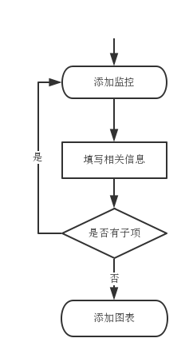

Omega Preliminary Design
===

引言
---

### 目的

统一DBA目前系统，为DBAs提供一个方便的平台，减少DBAs一些重复繁琐的工作。

### 背景

目前老系统对Mysql监控图表的显示异常，对Nosql监控缺乏，对slow，dbrt等系统有需求，急需一套管理系统，所以本系统提上日程。目前系统名叫Omega，对于以后分布在各监控对象上的Agent，可命名为 Alfa。

总体设计
---

第一期完成最基本的监控和报警功能，第二期完成slow，dbrt等功能，后续还会增加job调度管理等功能。期间会不定时的对系统进行完善和优化。

### 需求分析

#### 监控

对于监控模块，需要满足如下条件：

- 提供 RESTful API
- 3种级别的展示，每种级别的展示包括相应级别需要监控的具体项，每个具体项为一张图表，每个具体项中可包括一级子项——即每张图中可包括多种子监控项。3种级别如下：
 - 组/集群
 - Host
 - Instance
- 每种级别都可以被订阅及接警
- 对于所有监控内容，使用同一套逻辑。如Mysql和Redis监控，不需要多次编程

#### 报警

报警模块需要尽量提供可定制化。其内容主要如下：

- 接警人   
- 报警频率  
  每隔多长时间接收报警
- 延迟报警  
  连续N分钟异常则报警
- 报警方式  
 可使用消息通知中的方法
- 报警阈值
 - 差值
     - 具体值
     - 百分比
 - 极值
 - 斜率

#### CMC

整个系统的配置中心，包括如下范围：

- SSH KEY

### 运行环境

全系统使用的软件及版本如下：

- Python2.7
- Django==1.6.5

### 基本设计概念和处理流程
总体结构图如下：


各个子平台如下：
- Monitor
- Slow
- DBRT
- Report
- Job
- CMC(配置管理中心)

先说下通用模块。

- 登录与权限
- 远程执行命令
- 消息通知（邮件、短信）
- 基础算法
- 订阅
- 报警

对于不同的模块，可使用不同的消息通知方法，如监控报警的消息通知可为邮件和短信，而 DBRT，Slow等模块只需使用邮件提醒即可。对于用户的操作部分，直接在页面提示。

- 搜索
- SQL解析与优化
- Job调度

### 数据设计
#### ER图
如下


#### 数据表定义如下

包括目前Mysql的各种分组，Redis集群中分组，Memcached分组，Hadoop群集的分组等


all_dbs

```
CREATE TABLE dbs {
    id INT UNSIGNED NOT NULL AUTO_INCREMENT,
    gid INT UNSIGNED NOT NULL DEFAULT 0 COMMENT '组id',
    db VARCHAR NOT NULL DEFAULT '' COMMENT 'db名',
    primary key(id)
}ENGINE=INNODB DEFAULT CHARSET=utf8;
```

Group，同时还包括自定义的分组。其字段如下：

```
CREATE TABLE groups (
id INT UNSIGNED NOT NULL PRIMARY KEY AUTO_INCREMENT,
name VARCHAR(50) NOT NULL DEFAULT '' COMMENT '组名',
type TINYINT NOT NULL DEFAULT 0 COMMENT '组类型，未指定:0,', 
description VARCHAR(100) NOT NULL DEFAULT '' COMMENT '描述业务', 
scenario VARCHART(500) NOT NULL DEFAULT '' COMMENT '使用场景',
contacts VARCHAR(100) NOT NULL DEFAULT '' COMMENT '联系人', 
updatetime TIMESTAMP NOT NULL DEFAULT CURRENT_TIMESTAMP ON UPDATE CURRENT_TIMESTAM 
) ENGINE=INNODB DEFAULT CHARSET=UTF8;
```

查找某db所属组：
`SELECT id, name from groups where type=? and dbs like %?%;`

Host表如下：

```
CREATE TABLE hosts (
id INT NOT NULL AUTO_INCREMENT PRIMARY KEY,
host VARCHAR(32) NOT NULL DEFAULT '' COMMENT '主机名',
cores INT NOT NULL DEFAULT 0 COMMENT 'cpu核数',
memory varchar(30) NOT NULL DEFAULT 0 COMMENT '内存大小'
disk_num VARCHAR(50) NOT NULL DEFAULT '' COMMENT '磁盘数,若多种类型磁盘，以空格做分隔',
disk_size VARCHAR(50) NOT NULL DEFAULT '' COMMENT '总磁盘大小，多种类型磁盘，以空格做分隔'
disk_type VARCHAR(50) NOT NULL DEFAULT '' COMEMNT '磁盘类型', 
raid VARCHAR(50) NOT NULL DEFAULT '' COMMENT '',
ips VARCHAR(256) NOT NULL DEFAULT '' COMMENT '多个ip使用, 做分隔',
status TINYINT(1) NOT NULL DEFAULT 0 COMMENT '机器状态。offline:0，online:1',
bbu_relearn_flag TINYINT(1) NOT NULL DEFAULT 0 COMMENT '电池充放电。不手动充放:0，手动充放:1',
bbu_relearn_date DATE NOT NULL DEFAULT '0000-00-00' COMMENT '下次充放电日期',
updatetime TIMESTAMP NOT NULL DEFAUTL CURRENT_TIMESTAMP ON UP CURRENT_TIMESTAMP
)ENGINE=INNODB DEFAULT CHARSET=UTF8 COMMENT='所有主机相关信息';
```

mysql实例表：

```
CREATE TABLE instances (
id INT NOT NULL AUTO_INCREMENT PRIMARY KEY,
gid INT NOT NULL DEFAULT 0 COMMENT '组id',
hid INT NOT NULL DEFAULT 0 COMMENT 'host_id',
port SMALLINT UNSIGNED NOT NULL DEFAULT 0 COMMENT 'port号',
ips VARCHAR(256) NOT NULL DEFAULT '' COMMENT 'port对应的ip',
memory VARCHAR(20) NOT NULL DEFAULT '' COMMENT '分配内存',
version VARCHAR(10) NOT NULL DEFAULT '' COMMENT '版本',
socket VARCHAR(64) NOT NULL DEFAULT '' COMMENT 'socket pid',
parameters VARCHAR(100) NOT NULL DEFAULT '' COMMENT '命令启动的其他参数',
persistence TINYINT(1) NOT NULL DEFAULT 0 COMMENT '是否持久化，针对redis。否：0，是：1',
role TINYINT(1) NOT NULL DEFAULT 0 COMMENT '角色。master/namenode:1, secondnamenode/backup_master:2, slave/datanode:3',
status TINYINT(1) NOT NULL DEFAULT 0 COMMENT '状态。offline|error:0, online|ok:1, etl&backup: 2',
updatetime TIMESTAMP NOT NULL DEFAULT CURRENT_TIMESTAMP ON UPDATE CURRENT_TIMESTAMP,
KEY idx_id(gid, hid)
)ENGINE=INNODB DEFAULT CHARSET=UTF8 COMMENT='所有的实例表';
```


redis实例表：

memcached

因为关注较多的是某个group下实例情况，较少关注group下的host情况，所以这里将gid也放在`instance`表中，

显示所有实例时，根据`groups`中的结果来查找所有实例，查询语句如下：
`SELECT * from instances where gid=$groups.id`。

图表monitor_charts表：

```
CREATE TABLE monitor_charts (
id INT NOT NULL AUTO_INCREMENT PRIMARY KEY COMMENT '图表ID',
chart_name VARCHAR(50) NOT NULL DEFAULT '' COMMENT '图表名称',
gid INT NOT NULL DEFAULT 0 COMMENT 'group id',
hid INT NOT NULL DEFAULT 0 COMMENT 'host id',
instance_id INT NOT NULL DEFAULT 0 COMMENT 'instance表id',
contacts VARCHAR(200) NOT NULL DEFAULT '' COMMENT '联系人or接警人邮箱，以 , 做分隔',
alarm_status TINYINT(1) NOT NULL DEFAULT 0 COMMENT '是否开启报警。开启：1，关闭：0',
interval INT NOT NULL DEFAULT 1 COMMENT '报警间隔，单位为分',
last INT NOT NULL DEFAULT 0 COMMENT '延时报警，单位为分',
mode TINYINT NOT NULL DEFAULT 0 COMMENT '接警方式，邮件：0，短信：1，微信：2',
threshold VARCAHR(200) NOT NULL DEFAULT '' COMMENT '报警阈值，差值的百分比：1，差值的绝对值：2，极值：3，斜率：4，以json保存',
key idx_id(gid, hid, instance_id)
)ENGINE=INNODB DEFAULT CHARSET=utf8 COMMENT '监控图表信息'
```

数据源monitor_ds表：

```
CREATE TABLE monitor_ds (
id  INT NOT NULL AUTO_INCREMENT PRIMARY KEY COMMENT '数据源ID',
name VARCHAR(50) NOT NULL DEFAULT '' COMMENT '数据源名称',
chart_id INT NOT NULL DEFAULT 0 COMMENT 'chart id',
)ENGINE=INNODB DEFAULT CHARSET=utf8 COMMENT '监控数据源的信息表';
```

数据源monitor_ds_YYYYmmdd表：

```
CREATE TABLE monitor_ds_YYYYmmdd (
id INT NOT NULL AUTO_INCREMENT PRIMARY KEY,
ds_id INT NOT NULL DEFAULT 0 COMMENT '图表中数据源ID',
value INT NOT NULL DEFAULT 0 COMMENT '数据值',
updatetime timestamp NOT NULL DEFAULT CURRENT_TIMESTAMP ON UPDATE CURRENT_TIMESTAMP,
INDEX idx_1(ds_id, updatetime)
)ENGINE=INNODB DEFAULT CHARSET=UTF8 COMMENT '监控数据源的值';
```
插入语句：  
- `INSERT INTO monitor_ds_YYYYMMDD (ds_id, value, updatetime) VALUES(1000100, 30, '2009-12-12 12:12:00');`
查询语句：  
- `SELECT value FROM monitor_ds_YYYYMMDD where chart_id=1000 and ds_id=1000100 and updatetime>='2009-12-12 12:00:00' and updatetime<='2009-12-12 13:00:00';`

### 具体设计
#### 监控

目前监控要展示的图表除了mysql，nosql一些信息外，还需要展示自定义的监控信息。mysql，nosql的组，主机，port好理解，这里说下自定义监控的实现。

自定义监控中不包含M/S这种关系，也不包括除展示字段外的其他信息，其纯粹是数据的展示而已。基本设计思路是有N个基项，如网络，PV等，当需要监控这些基项的数据时，需要创建子项，若子项直接是图表，则创建图表，否则仍可创建子项，直至最后为图表为止。如下：




#### ManagementCenter
ManagementCenter是配置管理中心。

- 查看机器角色
对于Mysql/redis，有Master/Slave之分，且该角色定义在端口上。但对于Hadoop而言，其角色名为NameNode/SecondNameNode/DataNode，一个主机也可同时做NameNode和DataNode，角色定位在主机上。Hbase角色为HMaster/RegionServer，角色定位在主机上。

#### 搜索
搜索常有的几种需求如下：
- 查找db所在的组
- 根据DBRT号查找DBRT
- 查找JOB
- 查看机器的监控
- 查看机器的slow

这里不考虑全文索引。目前所使用的方式是在相应表中再加一个字段，如对于查找db所在组的需求，其实现方法是在group表中加一个`db`字段，用以存放每个group对应的db，查询时使用 `WHERE db LIKE %key%` 的方式来实现。此方案对字段限制过于严格，只能满足对这一字段的搜索，对于其他字段的搜索还需另写SQL语句，不太适合全局搜索。

另外一种方案仍是每个表中再新加一个字段`search_field`，该字段存放的值是每行所有字段（不包括`search`字段本身）的合集，各字段之间以某一个delimiter分隔。查询时使用`WHERE search_field LIKE %key%`来实现。该方法能消除前一方法的限制，但仍有一些缺点。

- 数据冗余
- `LIKE %key%` 不能使用索引，且匹配多余数据，如 `LIKE %property_db%`，除了匹配 `propertys_db`，还会匹配`propertys_db_04`
- 不能满足同时有多个匹配的情况，即使满足多个匹配的情况，但匹配词序固定，对于`condition1 condition2`，只能是`LIKE %condition1%condition2%`，对于`condition2 condition1`的情况无法匹配出来。
- 无法自适应控制结果的重要顺序。对于所有结果返回的顺序一样，无法自适应调整优先级。

还有一种做法是建立一个搜索表，将需要搜索的字段都放在该表中，能满足多字段的搜索，同时能做到根据结果重要性排序返回。在使用该方法时，不希望使用 `LIKE`的方式，使用在搜索输入框中会用redis/jquery来做自动完成的功能。该方法的缺点是对于少部分情况会出现搜索不到的情况，不过对于这种情况，可以将待搜索字段加入到搜索表中即可。

当然，还可以开源的一些工具，如 solr, nutch, elasticsearch 等。这里暂时定为使用es。

### 类设计
#### Message

`Message`类做为邮件，系统内提示消息等的父类。其类图关系如下：


```
Class Message(object):

    """
    All message classes' Base Class
    """

    def __init__(self):
        self._threshold = None
        self._content = None

    def condition(self, v):
        """ send message's trigger condition """
        return v?true:false

    @property
    def threshold(self):
        return self._threhold

    @threshold.setter
    def threshold(self, ts):
        self._threshold = ts

    @property
    def content(self)：
        return self._content

    @content.setter
    def content(self, con):
        self._content = con
        
    @property
    def level(self):
        return self._level

    @level.setter
    def level(self, l):
        self._level = l

    def send(self):
        ...

```

`RemoteMessage`如下:

```
class RemoteMessage(Message):
    """ the message of email, mobile message and webchat etc.."""

    @property
    def mode(self):
        """
        mode: email, mobile message, webchat and so on
        """
        return self._mode

    @mode.setter
    def mode(self, m):
        self._mode = m

    @property
    def method(self):
        """
        method: extremum（极值），scope（范围），gradient（斜率）
        """
        return self._method

    @method.setter
    def method(self, meth):
        return self._method = meth

    @property
    def receiver(self):
        return self._reciver

    @receiver.setter
    def receiver(self, new_receiver):
        self._receiver.add(new_receiver)

    def add_receiver(self, new_receiver):
        receiver.setter(new_receiver)

    @receiver.deleter
    def receiver(self, del_receiver):
        del self._receiver[del_receiver]
```

#### Item 相关

如下图是监控类相关的一些类图：


### REST API的设计

REST设计中URI为一系列的资源，其通过HTTP方法来表示CRUD（对应POST, GET, PUT, DELETE四个http方法）。这里以monitor模块中的一些需求来说明URL。

- CREATE
在monitor模块下，新建一个组，使用POST方法，对应的RESTful URI为 `http://dba.corp.anjuke.com/monitor/groups`。这里需要注意group使用复数。

- READ
查找monitor中组号为G1，host=db10-001的主机信息，使用GET方法，RESTful URI为 `http://dba.corp.anjuke.com/monitor/mysql/groups/g1/hosts/db10-001`。而对于可选参数的URI，使用key-value的形式传入参数，如`http://dba.corp.anjuke.com/monitor?group=g1&contacts=mingma`。关于 REST API 和 Query String Parameter 的选择，可参考[REST API Best practices: Where to put parameters?](http://stackoverflow.com/questions/4024271/rest-api-best-practices-where-to-put-parameters)。

- UPDATE
更新monitor中组号为G1，host=db10-001的主机信息，使用PUT方法，RESTful URI为 `http://dba.corp.anjuke.com/monitor/mysql/groups/g1/hosts/db10-001`。

- DELETE
删除monitor中组号为G1，host=db10-001的hostname，使用DELETE方法，RESTful URI为 `http://dba.corp.anjuke.com/monitor/mysql/groups/g1/hosts/db10-001/hostname`

对于请求结果状态，使用[HTTP响应码](http://www.restapitutorial.com/httpstatuscodes.html)来表示。在HTTP方法中，GET, PUT, DELETE都是幂等的，对于DELETE方法而言，第二次调用时返回404。

参考
- [REST wiki](zh.wikipedia.org/zh/REST)
- [REST API](http://www.restapitutorial.com/)
- [django-rest-framework](http://www.django-rest-framework.org/)


